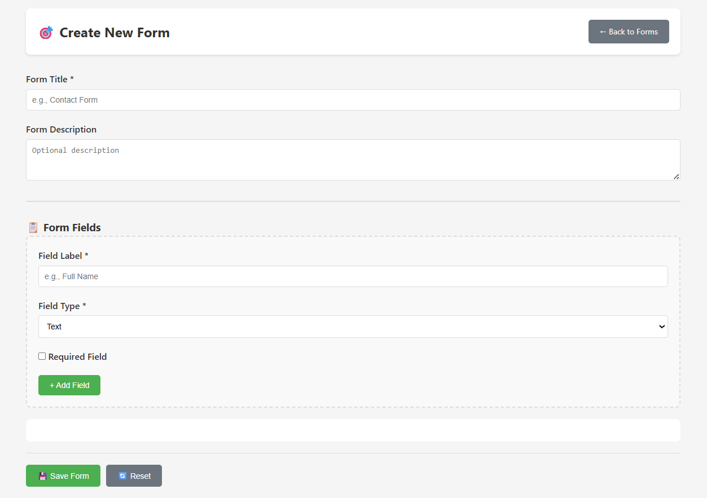
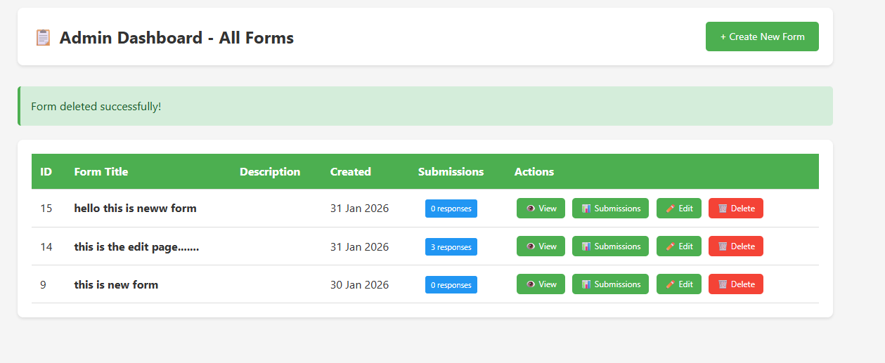
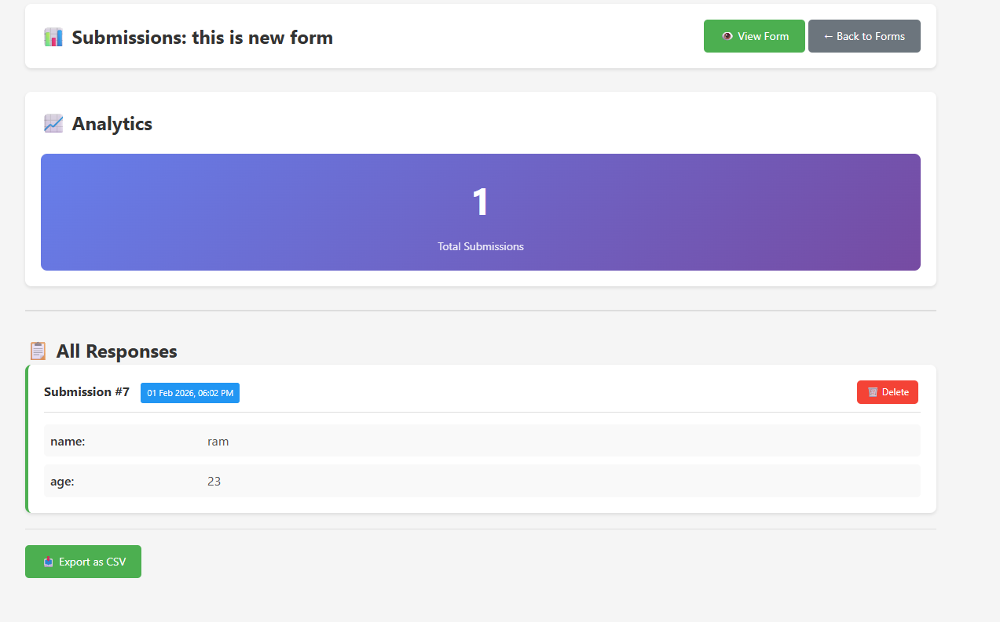

# form-builder

## 1. Project Overview
This project is a Dynamic Form Builder web application where forms are created and managed dynamically using a database. The admin can create forms, view submissions, and manage forms and submission data. Users can view the generated forms, fill them, and submit responses. The project focuses on dynamic form creation, management, and validation.

## 2. Features Implemented
- Admin can create dynamic forms
- Admin can view the list of all created forms
- Admin can delete forms
- Admin can view form submissions
- Admin can delete form submissions
- Dynamic form rendering for users
- Client-side validation for required fields
- Server-side validation using PHP
- Database-driven form and submission management

## 3. Tech Stack Used
- Frontend: HTML, CSS, JavaScript
- Backend: PHP
- Database: MySQL
- Server Environment: XAMPP (Apache, MySQL)

## 4. Database Setup Instructions
1. Open phpMyAdmin
2. Create a new database (for example: `dynamic_form_db`)
3. Import the provided `database.sql` file
4. All required tables for forms and submissions will be created automatically

## 5. Steps to Run the Project Locally
1. Install XAMPP on your system
2. Start Apache and MySQL services
3. Copy the project folder into the `htdocs` directory
4. Update database credentials in `config/db.php`
5. Open your browser and navigate to: http://localhost/form-builder/admin/create-form.php

## 6. Admin Panel Access Details
Admin authentication is not implemented in this project.
Admin functionalities such as form creation, viewing forms, viewing submissions, and deleting forms or submissions can be accessed directly without login.

## 7. Screenshots (Optional)
Screenshots of the admin form creation page, form list, and submission list can be added here.
### Admin – Create Form

### Admin – Form List

### Admin – Submissions

## 8. Bonus Features Implemented
- Fully database-driven form structure
- Modular and reusable PHP code
- Secure handling of form input
- Easy form and submission management

## Future Scope
- Admin authentication and login system
- Role-based access control
- Submission analytics and export functionality

